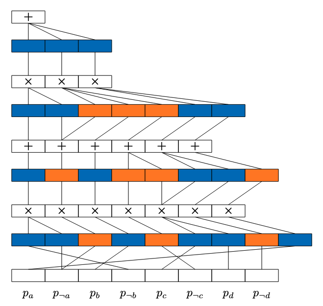

.. KLay documentation master file, created by
   sphinx-quickstart on Fri Mar 14 13:16:49 2025.
   You can adapt this file completely to your liking, but it should at least
   contain the root `toctree` directive.

KLay Documentation
==================

KLay is a Python library for accelerating inference on sparse arithmetic circuits.

At its core, KLay transforms sparse directed acyclic graphs into layers that can be executed in parallel.

.. toctree::

   Home <self>
   quickstart
   api

